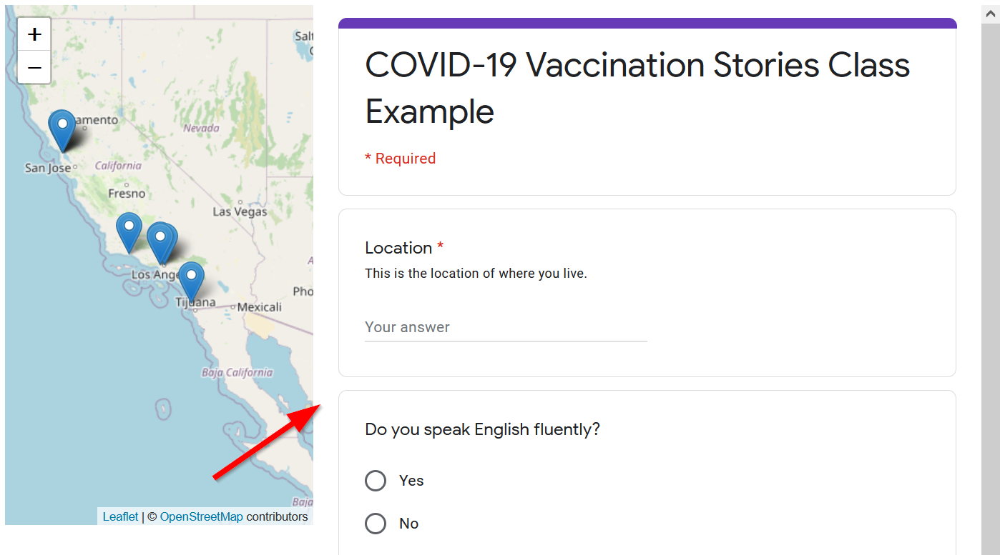
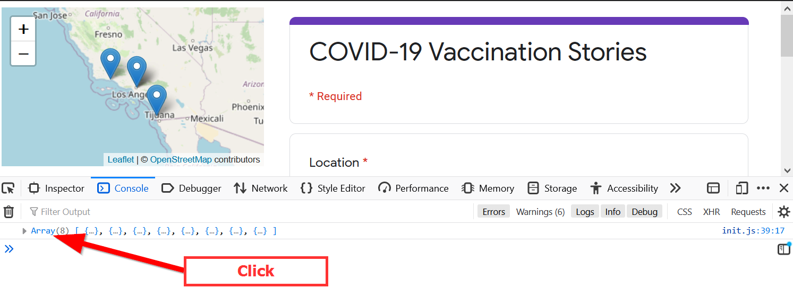
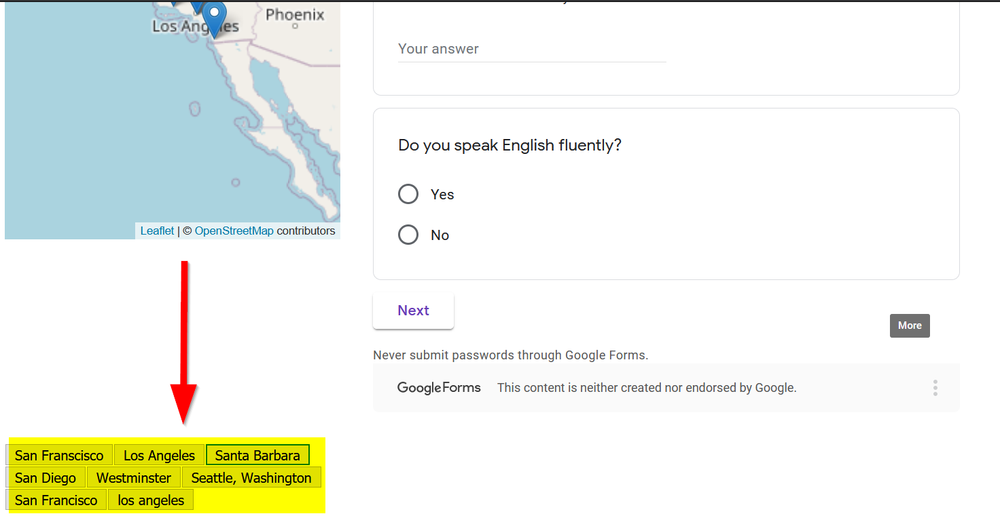
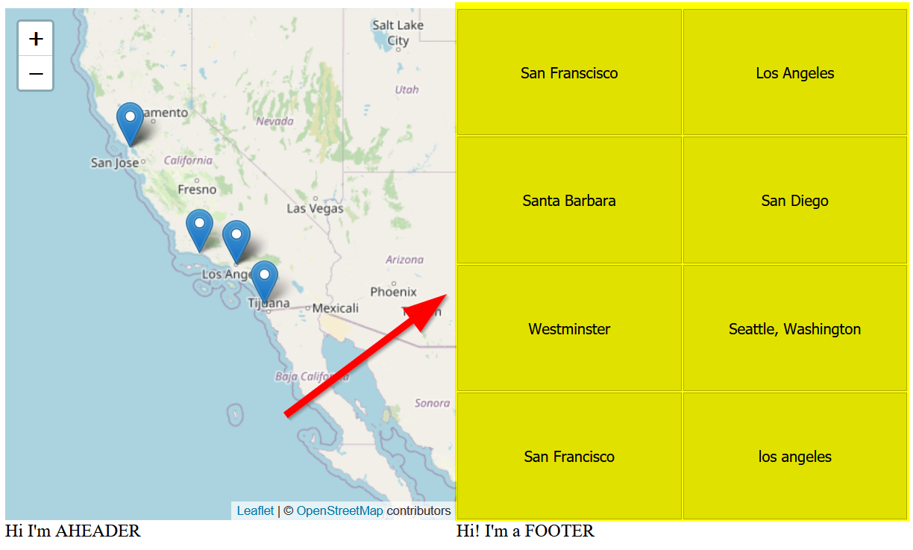
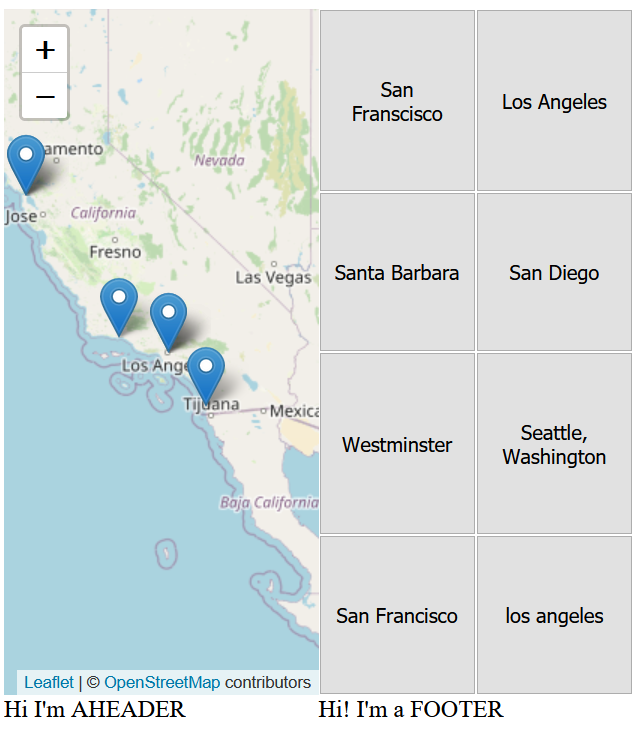

# Design DeCSSions
### Objectives:
- Add content from Google Form into a `div`
- Use CSS Grid to change page layouts

Today's lab will cover how to put your data in other places besides just the map and work with CSS Grid layouts. 

Start by creating a `week_5` folder in your assignments repo.

> ### Optional: If you want to work with your own layout, you can copy the contents of your `week_4` folder and skip the following setup section.

## Setup
Create the following files:
> index.html
``` html
<!DOCTYPE html>
<html>
    <head>
        <title>Basic Leaflet Map</title>
        <meta charset="utf-8" />
        <link rel="shortcut icon" href="#">
        <link rel="stylesheet" href="styles/style.css">

        <!-- Leaflet's css-->
        <link rel="stylesheet" href="https://unpkg.com/leaflet@1.7.1/dist/leaflet.css" />

        <!-- Leaflet's JavaScript-->
        <script src="https://unpkg.com/leaflet@1.7.1/dist/leaflet.js"></script>
    </head>
    
    <body>
        <div id="mapArea"></div>
        <div id="survey">
        <!-- this is the iframe for our survey -->
    <iframe 
    src="https://docs.google.com/forms/d/e/1FAIpQLSdqVT10bEbUrULMu6Etwj4ZBXGf-LAxcKohAINFbIdZmHS6OA/viewform?embedded=true" 
    width="640" 
    height="654" 
    frameborder="0"
    marginheight="0"
    marginwidth="0">
        Loading…
    </iframe>
        </div>
        <script src="js/init.js"></script>
    </body>
</html>
```

> js/init.js
```js
const myMap = L.map('map').setView([34.0709, -118.444], 5);

L.tileLayer('https://{s}.tile.openstreetmap.org/{z}/{x}/{y}.png', {
    attribution: '&copy; <a href="https://www.openstreetmap.org/copyright">OpenStreetMap</a> contributors'
}).addTo(myMap);

function addMarker(data){
        // console.log(data)
        // these are the names of our lat/long fields in the google sheets:
        L.marker([data.lat,data.lng]).addTo(myMap).bindPopup(`<h2>${data.timestamp}</h2>`)
        return data.timestamp
}

let url = "https://spreadsheets.google.com/feeds/list/1j3a2do9HIS6xvpBsKMjmI4soNaqGdlnIkwYQHktmp1U/oua1awz/public/values?alt=json"

fetch(url)
	.then(response => {
		return response.json();
		})
    .then(data =>{
                // console.log(data)
                formatData(data)
        }
)


function formatData(theData){
        const formattedData = [] /* this array will eventually be populated with the contents of the spreadsheet's rows */
        const rows = theData.feed.entry
        for(const row of rows) {
          const formattedRow = {}
          for(const key in row) {
            if(key.startsWith("gsx$")) {
                  formattedRow[key.replace("gsx$", "")] = row[key].$t
            }
          }
          formattedData.push(formattedRow)
        }
        console.log(formattedData)
        formattedData.forEach(addMarker)        
}
```


>styles/style.css

**Note: The folder is named `styles`!!!!**
```css
body{
    display:grid;
    grid-template-columns: 1fr 1fr; /* this creates an even two column layout*/
    grid-template-areas: "mappanel sidepanel" /* this creates one row with map panel on the left and sidepanel on the right */
}

#mapArea{
    height:90vh;
    grid-area: mappanel;
} 

#survey{
    grid-area: sidepanel;
} 
```

## Warming up to some in-line CSS
Notice how the survey on the right is not really abiding by our CSS grid styles:



This is caused by the `iframe` element with its `in-line CSS`: 
```html
    <iframe 
    src="https://docs.google.com/forms/d/e/1FAIpQLSdqVT10bEbUrULMu6Etwj4ZBXGf-LAxcKohAINFbIdZmHS6OA/viewform?embedded=true" 
    width="640" 
    height="654" 
    frameborder="0"
    marginheight="0"
    marginwidth="0">
        Loading…
    </iframe>
```

We can fix that by changing `width` and `height` to `100%`:

```html
    <iframe 
    src="https://docs.google.com/forms/d/e/1FAIpQLSdqVT10bEbUrULMu6Etwj4ZBXGf-LAxcKohAINFbIdZmHS6OA/viewform?embedded=true" 
    width="100%" 
    height="100%" 
    frameborder="0"
    marginheight="0"
    marginwidth="0">
        Loading…
    </iframe>
```
Much better:


Now with our CSS Grid looking good, we can move forward with the rest of lab!

## Getting our data in place!
If you have not already done so, start `VS Code`'s **live server** to make sure that the code running. 

In Firefox, open up the `Debug Console` (right click inspect element OR pressing `F12`) and click on the array from last week:



In an JSON object, `keys` are essentially the **field names**:


And `values` are the **contents**:


Remember, to access a value, you have to access the `object` and then the `key` using `.` notation.

For example, last week when we wanted the `lat` data, we used `data.lat`.

#### Prepping the `div`
In our `index.html` file, let's add a `<div>` for our new content:

>index.html
```html
        <div id="contents"></div>
        <!-- add before the map div, or after, either way works.
         Because we will define the layout in CSS Grid -->

```
Now, let's look at the `location` key. We probably want to add the locations to our contents to see what locations or showing up, as some people might put the same location more than twice! 

We probably want to make buttons from these locations soooo....

### Pop-Quiz! Do you remember how to create buttons from Lab #2?

Where would it be best for a line to create buttons go?
`createButtons(lat,lng,title);`

<details>

<summary><b>Answer</b></summary>

Correct, it should go in our `addMarker()` function! So that when we add markers, buttons are added afterwards!
</details>

Add the line for the familar `createButton()` function in our JavaScript file:

>js/init.js

```js
function addMarker(data){
        // console.log(data)
        // these are the names of our lat/long fields in the google sheets:
        L.marker([data.lat,data.lng]).addTo(myMap).bindPopup(`<h2>${data.timestamp}</h2>`)

        createButtons(lat,lng,location)
        
        return data.timestamp
}
```
And now, just like in lab 3, we are going to add buttons!

``` js
function createButtons(lat,lng,title){
    const newButton = document.createElement("button"); // adds a new button
    newButton.id = "button"+title; // gives the button a unique id
    newButton.innerHTML = title; // gives the button a title
    newButton.setAttribute("lat",lat); // sets the latitude 
    newButton.setAttribute("lng",lng); // sets the longitude 
    newButton.addEventListener('click', function(){
        myMap.flyTo([lat,lng]); //this is the flyTo from Leaflet
    })
    document.body.appendChild(newButton); //this adds the button to our page.
}
```

Wait.. it didn't work? Well, that's because we have to tweak a few things...

Any ideas?

<details>

<summary><b>Answer</b></summary>

1. First we need to make sure we use `data` object! Which means making sure we use the `object` + `.` + `key` format.


2. Next we need to change the `document.body.appendChild(newButton)` to use the `div` that we created earlier! 

</details>

### Accessing object keys again

To address the issue of our data being stored in an object, the `createButton()` function should look like this:
```js
createButtons(data.lat,data.lng,data.location)
```
> - Where we are accessing the `data` `object`'s `lat`, `lng`, and `location`. 
> - **Note:** Your `keys` MUST match your data `object`!!
>  - For example: If your survey spreadsheet has `latitude` instead of `lat` then the you MUST use `data.latitude`

### Adding buttons to our `div`

To address the second issue of targeting our `div`, we need to utilize the JavaScript method of selecting Elements called:

`getElementById()`

[Learn more about `getElementById()`](https://developer.mozilla.org/en-US/docs/Web/API/Document/getElementById)

Just running the method doesn't do anything, so we need to store it in a variable:

```js
const spaceForButtons = document.getElementById('contents')
```

Remember the `appendChild()` that adds content?
We will use that method to add our button to our `spaceForButtons` variable that specifies the `div`:

```js
spaceForButtons.appendChild(newButton);
```

The final `createButtons()` and `addMarker()` functions should look like this:


``` js
function addMarker(data){
        // console.log(data)
        // these are the names of our lat/long fields in the google sheets:
        L.marker([data.lat,data.lng]).addTo(myMap).bindPopup(`<h2>${data.timestamp}</h2>`)
        // adding our create button function
        createButtons(data.lat,data.lng,data.location)
        return data.timestamp
}

function createButtons(lat,lng,title){
    const newButton = document.createElement("button"); // adds a new button
    newButton.id = "button"+title; // gives the button a unique id
    newButton.innerHTML = title; // gives the button a title
    newButton.setAttribute("lat",lat); // sets the latitude 
    newButton.setAttribute("lng",lng); // sets the longitude 
    newButton.addEventListener('click', function(){
        myMap.flyTo([lat,lng]); //this is the flyTo from Leaflet
    })
    const spaceForButtons = document.getElementById('contents')
    spaceForButtons.appendChild(newButton);//this adds the button to our page.
}
```

Horrah!!

## CSS Grid time!
Ok, now that we got the buttons working, notice how they appear at the bottom?



This is because we don't have a space for them in our CSS Grid yet!

So time to style our page and make it more presentable!

Open up our `style.css` and find the `body` selector:

>styles/style.css
```css
body{
    display:grid;
    grid-template-columns: 1fr 1fr; /* this creates an even two column layout*/
    grid-template-areas: "mappanel sidepanel" /* this creates one row with map panel on the left and sidepanel on the right */
}
```
What do you notice here? Well, we have the `1fr 1fr` propety value under `grid-template-columns` property.

Let's turn to the other two selectors:
```css
#map{
    height:90vh;
    grid-area: mappanel;
} 

#survey{
    grid-area: sidepanel;
} 
```
Notice, our poor `contents` doesn't have a selector! Let's fix it by adding this:

```css
#contents{
    /* this gives the name to our area */
    grid-area: contentpanel;
}
```

`grid-area` gives the `#contents` selector the name `contentpanel` that we will use in the `grid-template-areas`.

### Assgining Grid-Template Areas

Go back to the `body` selector, and change the property `grid-template-areas`'s value to `"mappanel contentpanel"`, which is the name we assigned above:

```css
body{
    display: grid;
    grid-template-columns: 1fr 1fr; 
    grid-template-areas: "mappanel contentpanel"
}
```
Try flipping `mappanel` and `contentpanel` in the `property value`, what happens?

<details>

<summary><b>Answer</b></summary>

The mappanel showed up on the right-side! Being able to change layouts on-the-fly demonstrates the power of CSS Grid!
</details>

## CSS Grid Debugging in Firefox
### (Untested in Chrome or Safari)

In Firefox click on `Inspect Element` and make sure you are on the `Inspector`:


Click on `Layout`:


Then make sure `body` and `display area names` are checked:


You will notice that the names of the `grid areas` will display! Very very helpful when debugging CSS Grid!!!


## Home C-S-Stretch: Layouts!

For the last part of our exercise, the Google survey is going to get in our way because of the `iframe`'s `fixed` **width** and **height**, we can fix this by applying the following code:

>styles/style.css
```css
#survey {
    grid-area: survey;
    overflow: hidden;
    /* 16:9 aspect ratio */
    padding-top: 0%;
    position: relative;
}

#survey iframe {
   border: 0;
   height: 100%;
   left: 0;
   position: absolute;
   top: 0;
   width: 100%;
}
```
Head over to the `index.html`, let's add two elements, `<header>` before the `<map>` element and `<footer>` after our `<survey>` element:

>index.html
```html
<!-- ---- TRUNCATED FOR BREVITY ---- -->
    <body>
        <header>Hi I'm AHEADER</header> <!-- added this-->
        <div id="contents"></div>
        <div id="mapArea"></div>
        <div id="survey">
            <iframe src="https://docs.google.com/forms/d/e/1FAIpQLSdqVT10bEbUrULMu6Etwj4ZBXGf-LAxcKohAINFbIdZmHS6OA/viewform?embedded=true" width="100%" height="100%" frameborder="0" marginheight="0" marginwidth="0">Loading…</iframe>
        </div>
        <footer>Hi! I'm a FOOTER</footer> <!-- added this -->
        <script src="js/init.js"></script>
    </body>
<!-- ----TRUNCATED FOR BREVITY---- -->
```

Return to `/styles/style.css` and go to the `body` selector. Then change `grid-template-rows` to the following: `grid-template-rows: 1fr 1fr 1fr 1fr`. 

This creates 4 rows of evenly spaced content.

In our `grid-template-columns` we need one more `1fr` for our survey in:

`grid-template-columns: 1fr 1fr 1fr`

Finally, we need to add spaces after the `"header"` and `"footer"` template areas too which indicates which row the template is on:

`grid-template-areas: "header" "mappanel contentpanel" "footer"`

The `body` selector should look like the following:

>styles/style.css
```css
body{
    display: grid;
    grid-template-columns: 1fr 1fr 1fr; 
    grid-template-rows: 1fr 1fr 1fr 1fr; /* add rows for our header/footer */
    grid-template-areas: "header" "mappanel contentpanel" "footer"
}
```
#### Class Exericise #2
Add the right CSS selectors to the `header` and `footer` elements. 

Need a hint? These are not `div` elements!
<details>

<summary><b>Answer</b></summary>

```css
header{
    grid-area: header
}
footer{
    grid-area: footer
}

```
</details>

### Grid-ception and automatically fitting content!

While named `grid-template-areas` can be useful, if you have a lot of content, or if the content might grow in number, you can just specify the number that the content should occupy using the `grid-column` property and `repeat`. Additionally, we can start a `subgrid` within a `grid` element to specify which part of an already existing `grid` we want to visualize. 

- [More about `repeat`](https://developer.mozilla.org/en-US/docs/Web/CSS/repeat())

- [More about `subgrid`](https://developer.mozilla.org/en-US/docs/Web/CSS/CSS_Grid_Layout/Subgrid)

Let's apply a `subgrid` and `repeated columns` of 2 to the `#contents` selector:

```css
#contents{
    grid-area: contentpanel;
    display:grid;
    grid-template-columns: repeat(2, 1fr);
}
```

This creates a new column after every 2 evenly spaced item!!!



It even works when you resize the page!


So cool!!! 

Finally, if you turn on the debugger in Firefox, you can see that two grids show up now:


And there you have it! We've only scratched the surface of CSS Grid, but this is enough for you to complete this bonus lab assignment!

## Bonus Lab Assignment #1 - CSS Grid Layouts
### Due 7/26
Using your lab assignment from `week 4`, touch up your mapplication by creating a layout with CSS Grid and making a cohesive webpage.

The requirements are:
- A title for the webpage describing what is being shown
- Design a responsive-layout using [CSS Grid](https://developer.mozilla.org/en-US/docs/Web/CSS/CSS_Grid_Layout)
- Use a [sub-grid (grid-within-a-grid)](https://developer.mozilla.org/en-US/docs/Web/CSS/CSS_Grid_Layout/Subgrid)
- Utilize `buttons` or `divs` to interact with your map ([Revisit Lab #2 for more info](../../Week_02/Lab/readme.md))

### Extra Resources:

- [MDN CSS Grid Guides](https://developer.mozilla.org/en-US/docs/Web/CSS/CSS_Grid_Layout#guides)

- [CSS Grid Starter Layouts](https://css-tricks.com/snippets/css/css-grid-starter-layouts/)

- [CSS Grid Styling](https://www.w3schools.com/css/css_grid.asp)

## Submission
- Commit your changes to GitHub
- Find your `index.html` in the `Week_05` folder and copy the URL. It should look something like this:
  - https://albertkun.github.io/211A-ASIAAM-191A-Assignments/Week_05/index.html
- Paste your link as a comment in the Discussion forum for Lab Assignment #5: 
  - https://github.com/albertkun/211A-ASIAAM-191A/discussions/19
